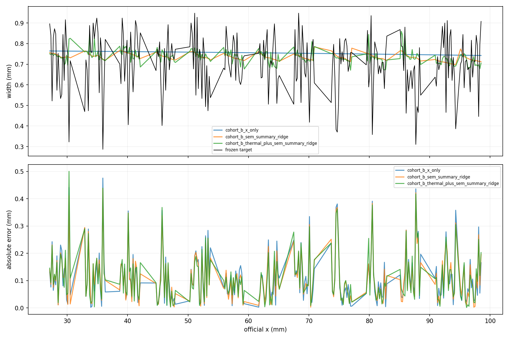
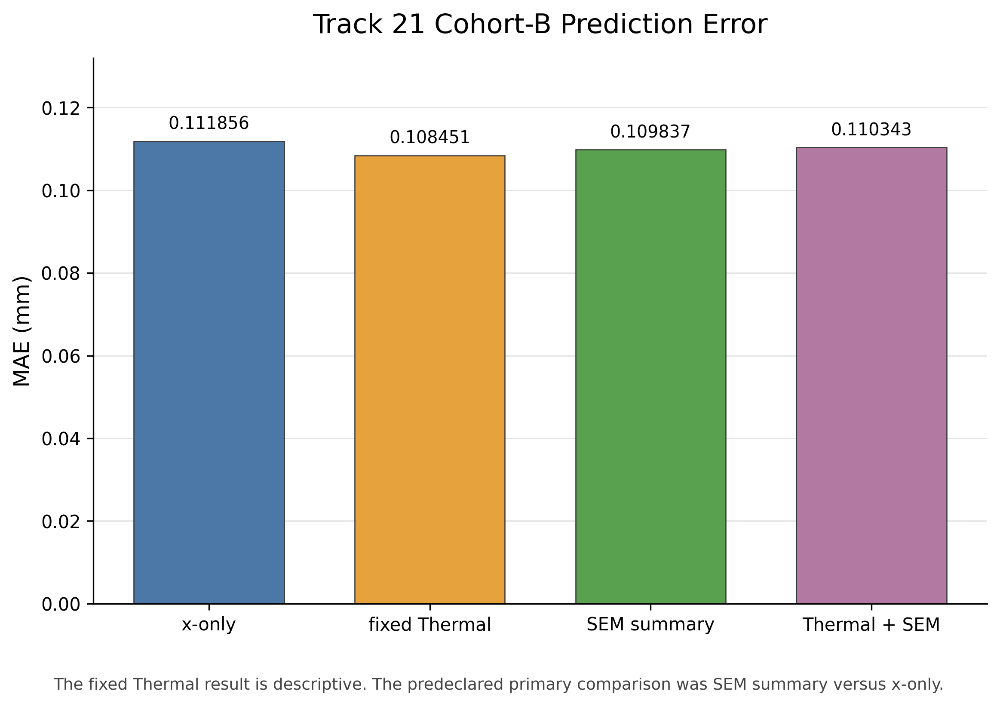
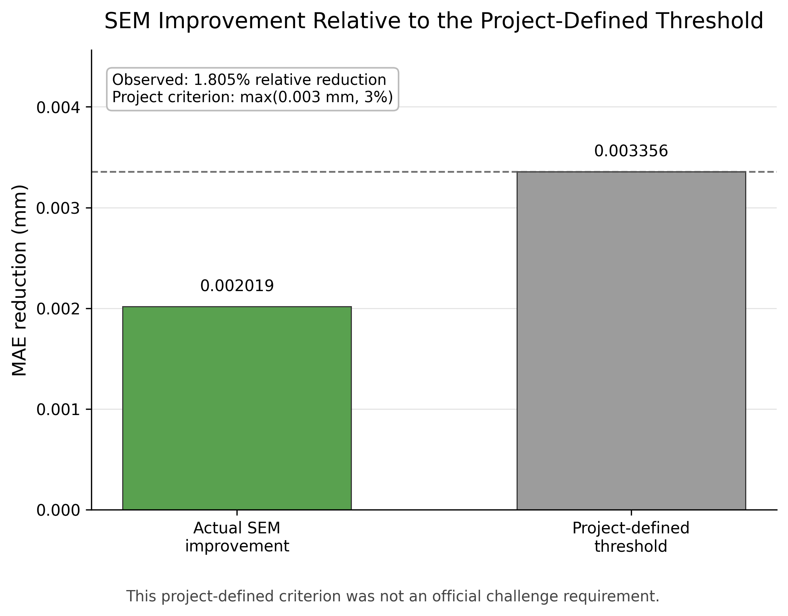
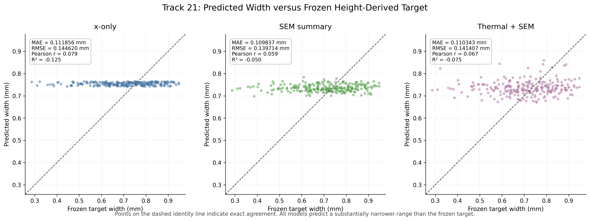
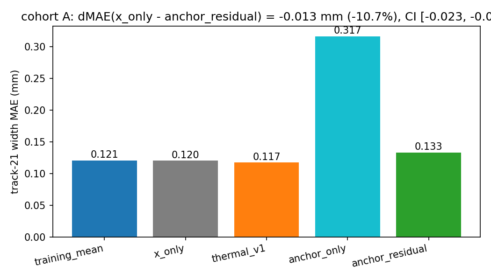
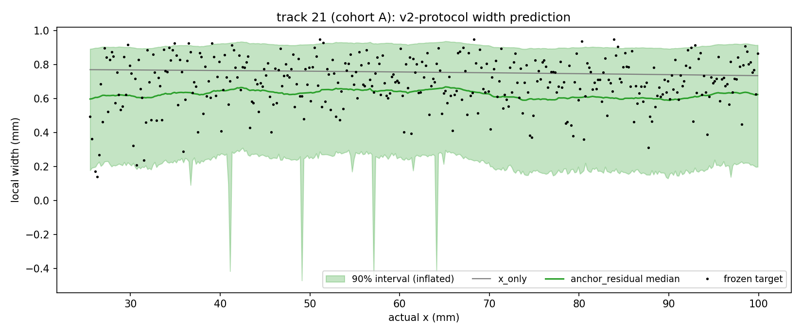
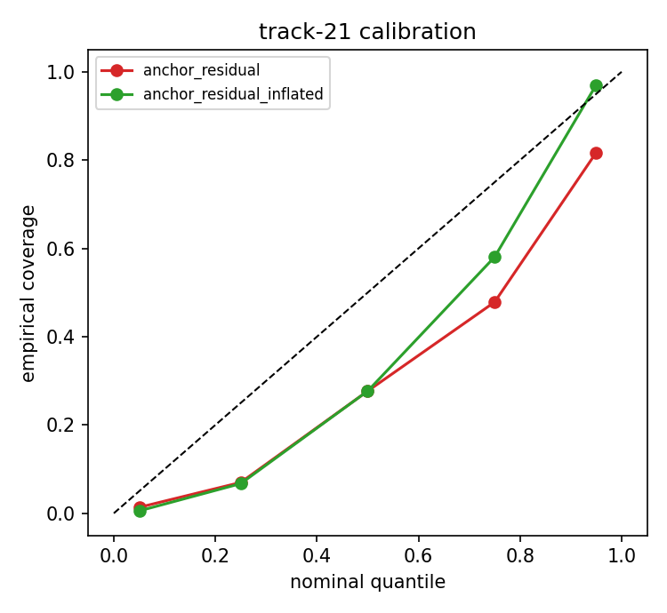

# Leakage-Safe Multimodal Prediction of Local DED Track Width

## Overview

This repository packages the frozen NSF Future Manufacturing Data Challenge workflow
for testing whether Thermal data and leakage-masked SEM context predict Height-derived
local deposited-track width under complete-Track holdout. The dataset is titled
*A Multimodal DED Dataset for Probabilistic Local Geometry Prediction in Laser Tracks*.

## Dataset modalities

The source dataset contains Thermal image sequences, SEM tiles, and post-process Height
maps for SS316L single DED tracks over an approximately 20–100 mm physical interval.
Raw challenge data are not included in this repository.

## Prediction target

`width_mm = y_right_mm - y_left_mm`

`center_mm = (y_left_mm + y_right_mm) / 2`

Height maps provide the target only; Height data are not model inputs.

## Data split

Development uses complete Tracks 8, 10, and 14. Final held-out testing uses Track 21.
Complete-Track holdout avoids leakage from nearby positions on the same physical track
that a random position split could introduce.

## Frozen pipeline

The workflow freezes Height estimator v1, the all-finite Height label policy, a fixed
Thermal shape representation, generalized contiguous N-to-1 SEM mapping, native-coordinate
SEM target masking, model coefficients, ridge alphas, and the project-defined
predeclared confirmation threshold.
There was no Track-21 fitting or model selection.

## Leakage-safe SEM protocol

- Protocol: `symmetric_two_strip_1mm_mask0p4mm_v1`
- Central exclusion: `x ± 0.40 mm`
- Upstream context: `1.00 mm`
- Downstream context: `1.00 mm`

Masking occurs in native SEM coordinates before resizing, filtering, or feature extraction.
The model input is **masked neighboring SEM context**; it is not described as substrate-only.

## Final results

| Model | Track-21 Cohort-B MAE |
|---|---:|
| x-only | 0.111856 mm |
| SEM summary | 0.109837 mm |
| Thermal + SEM | 0.110343 mm |

### Final Track-21 visualizations

#### Predictions along the physical track



#### Cohort-B MAE comparison



#### SEM improvement versus the project-defined threshold



#### Predicted width versus frozen target



The figures visualize the frozen Track-21 results. They do not represent additional
fitting or post-test model selection.

- SEM absolute improvement: 0.002019 mm
- SEM relative improvement: 1.805%
- Project-defined predeclared confirmation threshold: 0.003356 mm
- Additive Thermal improvement over SEM: -0.000506 mm

The threshold was defined by this project before the held-out Track-21 evaluation to
avoid overinterpreting very small improvements. It was not an official challenge scoring,
eligibility, or submission requirement.

SEM summary reduced the held-out MAE by 0.002019 mm, corresponding to a 1.805%
improvement over x-only. Therefore, the statement “SEM improvement not confirmed” is a
project-specific scientific interpretation and does not mean that the challenge
submission failed.

Under the project-defined predeclared criterion:

**SEM IMPROVEMENT NOT CONFIRMED ON FINAL TRACK 21**

Masked neighboring SEM context produced a small held-out MAE reduction on Track 21, but
the reduction did not reach the project-defined predeclared confirmation threshold.
Adding the fixed Thermal representation did not improve upon the SEM-only model.
See [Terminology and interpretation](docs/TERMINOLOGY_AND_INTERPRETATION.md).

## v2: isotherm-anchor quantile models

The v2 cycle adds a physics-anchored probabilistic width model. The
cross-track extent of a fixed-count isotherm is measured in each thermal
frame; since the deposited width is set by the solidification isotherm,
this extent is a width proxy that does not depend on laser power. A linear
anchor `width ~ k* x iso_extent` is calibrated on the development tracks
(frozen labels: c* = 1600, k* = 0.911), and linear quantile regressions
(q = 0.05...0.95) model the residual, so the output is a predictive
distribution rather than a point estimate. Interval width is corrected
with a level-uncertainty term from leave-one-track-out validation
(s_level = 0.118 mm). Confirmation now uses a paired moving-block
bootstrap (5 mm blocks, 2000 resamples) instead of a fixed-mm threshold:
confirmed only if the 95% CI of dMAE stays above 0 and the relative gain
is at least 5%.

Track 21 was already opened by the v1 test, so this run is a protocol
revision, not a fresh single-shot test. This is recorded in the v2 lock.

### Result on the frozen labels

| Model | Cohort-A MAE | Cohort-B MAE |
|---|---:|---:|
| x_only | 0.1203 mm | 0.1119 mm |
| thermal_v1 | 0.1175 mm | 0.1085 mm |
| anchor_only | 0.3167 mm | 0.3226 mm |
| anchor_residual | 0.1332 mm | 0.1319 mm |

dMAE(x_only - anchor_residual) = -0.013 mm, CI [-0.023, -0.004]:

**NOT CONFIRMED.** The frozen label widths barely change with laser power
(0.741 / 0.773 / 0.804 mm at 200-400 W), so there is no cross-power offset
for the anchor to remove; it adds one instead. The criterion rejects it.







### Sensitivity study: validity-run labels

The same frozen settings, evaluated under an alternative label estimator
that follows the resolidified band directly (the interferometer's per-y
valid-pixel fraction is near-binary across the track edge). These widths
do change with power (dev 1.031 / 0.858 / 0.722 mm; track 21: 0.485 mm)
and the anchor calibrates cleanly (c* = 1400, k* = 0.859, ratio CV 2.6%).
On 362 track-21 bins:

| Model | MAE |
|---|---:|
| x_only | 0.3798 mm |
| anchor_only | 0.0834 mm |
| anchor_residual | 0.1135 mm (90% coverage 0.906) |

dMAE = 0.266 mm (70.1%), CI [0.249, 0.281]: **CONFIRMED.**

The two estimators measure different bands. Gradient-edge widths are
nearly power-invariant; validity-run widths follow the solidification
band, which the melt-pool isotherm predicts across a 2x power range.
Whether the anchor helps depends on which band "width" means.

### v2 reproduction

```bash
python3 scripts/freeze_isotherm_anchor_v2.py
python3 scripts/freeze_final_height_width_model_v2.py
python3 scripts/run_final_track21_height_width_test_v3.py
python3 scripts/run_sensitivity_validity_run_labels_v2.py
```

v2 lock hash:
`8f18122e2192d714ce2e8b3766c3e993ac15d933df2b1fd7c191c274082622de`.
LaTeX report source under `report/`.

## Reproducibility and integrity

- 1192 / 1192 development mappings reproduced
- 678 / 678 development Cohort-B IDs reproduced
- 396 / 396 Track-21 mappings reproduced
- 233 / 233 Track-21 Cohort-B IDs reproduced
- Maximum prediction reproduction difference: 0.0
- Immutable files unchanged
- Production-equivalence audit passed

## Repository structure

`scripts/` contains the frozen execution and audit code; `src/` contains its local
helpers; `configs/` contains frozen protocols and locks; `outputs/` contains compact
published artifacts; `docs/` explains workflow, leakage controls, lock, and provenance.

## Installation

```bash
python3 -m venv .venv
source .venv/bin/activate
python3 -m pip install --upgrade pip
python3 -m pip install -r requirements.txt
```

On Windows PowerShell, activate with `.venv\Scripts\Activate.ps1`.

## Data setup

Obtain authorized access independently, then place the source files at the repository
root using the layouts described in [DATA_AVAILABILITY.md](DATA_AVAILABILITY.md):
`${DATA_ROOT}/thermal/`, `${DATA_ROOT}/sem/`, and `${DATA_ROOT}/height/`.
For unchanged scripts, `${DATA_ROOT}` is the repository root.

## Reproduction commands

See [REPRODUCIBILITY.md](REPRODUCIBILITY.md). The final stages are:

```bash
python3 scripts/prepare_final_test_sem_compatibility_amendment_v1.py
python3 scripts/run_final_track21_height_width_test_v2.py
MPLCONFIGDIR=/tmp/nsf_mplconfig python3 scripts/audit_generalized_sem_mapping_production_equivalence_v1.py
```

These require the original raw data and the preceding frozen artifacts. Earlier
development stages are documented in the reproduction guide.

## Expected checks

The model-lock hash is `2fb60cbb83a04ea9819c3bfff9fa39b9765dc9bad74b4a7d0693103af013be1b`. The amendment hash is `3c0de4b78b5417cd60df27bbb9e059bcf27986aaadd8964d14e51dbf831a847a`.
The development SEM-summary hash is
`4f8473e69b6c05d0049c920676b6cc0891b708bca176c86fd6acc51815033203`.
The production-equivalence terminal status is
`GENERALIZED SEM PRODUCTION IMPLEMENTATION EQUIVALENCE PASS`.

## Limitations

Automatic Height labels contain local measurement noise; SEM mapping is a low-confidence
full-mosaic endpoint-linear fallback; single-native-tile context reduces coverage; the
SEM gain was below the project-defined threshold; Thermal lacked stable additive value; and only a
small number of complete Tracks were available. See [LIMITATIONS.md](LIMITATIONS.md).

## Citation

See [CITATION.cff](CITATION.cff) for the recommended citation metadata.

## License

No open-source license has yet been assigned to this repository. Source code and artifacts are provided for inspection and reproducibility; reuse terms must be clarified by the repository owner.
